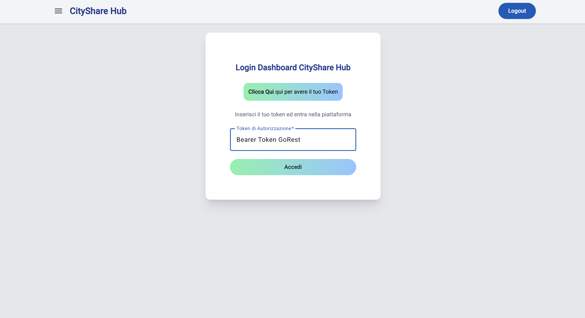
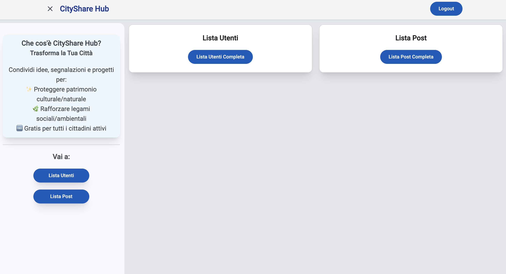
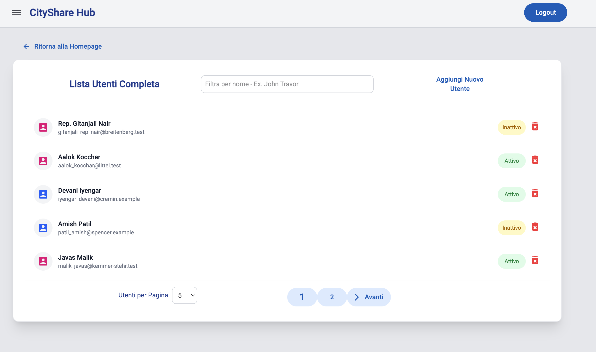
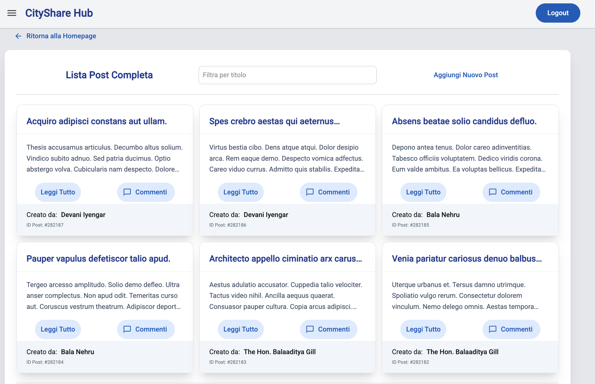
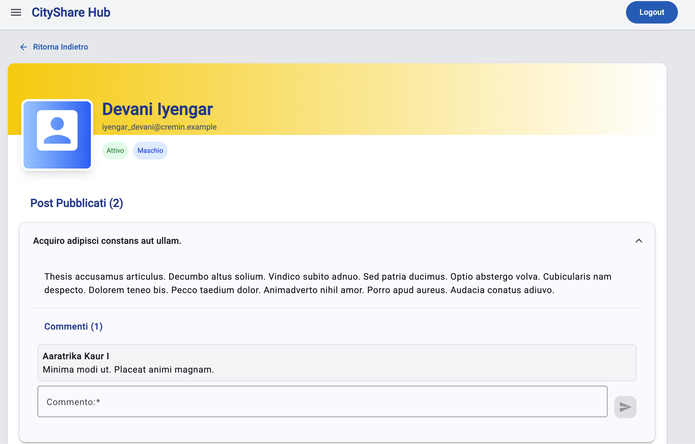

# CityShare Hub

## 🗂️ Indice

- [Descrizione](#-descrizione)
- [Screenshot Progetto](#-screenshot-progetto)
- [Funzionalità dell'Applicazione](#-funzionalità-dellapplicazione)
- [Tecnologie e Librerie Utilizzate](#-tecnologie-e-librerie-utilizzate)
- [Prerequisiti](#-prerequisiti)
- [Installazione e Configurazione](#-installazione-e-configurazione)
- [Struttura Del Progetto](#-struttura-del-progetto)
- [Contatti](#-contatti)

---

## 🏢 Descrizione

**CityShare Hub** è una dashboard creata per i cittadini, dove possono dare consigli sul miglioramento della propria città ed interagire con i propri compaesani.
La dashboard è stata sviluppata con Angular in modalità SPA (Single Page Application).

l'applicazione permette agli utenti di:
- Visualizzare e gestire profili utente;
- Creare e visualizzare post;
- Aggiungere propri commenti ai post
- Cercare utenti e post
- Visualizzare nel dettaglio le informazioni degli utenti

---

## 📸 Screenshot Progetto

### Schermata Login


### Schermata Dashboard


### Schermata Lista Utenti


### Schermata Lista Post


### Schermata Dettagli Utente


---

## 🛠️ Funzionalità dell'Applicazione

### 1. Sistema di Autenticazione

- **Login con Bearer Token**: L'applicazione utilizza l'autenticazione basata sul token di GoRest;
- **Protezione delle Route**: Tutte le Route principali sono protette da `AuthGuard`;
- **Storage Token**: Il token viene salvato in `localStorage` per mantenere la sessione aperta;
- **Logout**: Funzionalità di `logout` che rimuove il token dal `localStorage` e reindirizza al `login`.

**Come Funziona**:
1. l'utente inserisce il Bearer Token ottenuto da GoRest;
2. Il tuo token viene validato tramite una chiamata API;
3. Se valido, viene salvato e l'utente reindirizzato verso la Homepage;
4. Tutte le richieste HTTP successive includono il token di autenticazione utilizzato all'accesso;

### 2. Homepage

- **Visualizzazione pannelli**: L'utente effettuato l'accesso arriva alla homepage, dove visualizza due pannelli per la lista utenti e la lista post.
- **Sidenav**: Nella sidenav, apribile tramite il bottone nell'header, viene visualizzata una piccola presentazione di CityShare Hub e due bottoni shortcut per andare alla lista utenti e alla lista post.

### 3. Lista Utenti

#### Funzionalità:

1. **Visualizzazione Lista Utenti**: La lista utenti è di default da 5 item, ma è possibile modificarla con l'apposito selettore.
2. **Ricerca Utente**: Tramite la barra di ricerca è possibile filtrare un utente per il nome.
3. **Creazione Nuovo Utente**: Il bottone Aggiungi Utente apre un dialog modale con form validato: Nome, Email (formato email), Genere (Maschio / Femmina), Stato (Attivo / Inattivo). All'invio vi è la validazione immediata con messaggio di errore e feedback tramite Toaster per il successo o l'insuccesso dell'aggiunta.
4. **Eliminazione Utente**: Ogni Item Utente ha un bottone per effettuare l'eliminazione dell'utente stesso, con avvenuta conferma tramite Toaster ed aggiornamento automatico della lista.
5. **Visualizzazione Dettagli Utente**: Ogni Item Utente ha un bottone per entrare nella sua pagina dedicata ai Dettagli Utente.
6. **Tasto Homepage**: Il tasto Homepage permette di tornare indietro nello storico del browser.

### 4. Lista Post

#### Funzionalità: 

1. **Visualizzazione Lista Post**: In questo caso la lista post è composta da Card, 6 di default che si possono modificare con l'apposito selettore.
3. **Card Post**: La card è composta dal titolo, il contenuto, il bottone Leggi Tutto, Il bottone per caricare i commenti, il Nome del Creatore del post e l'ID di identificazione del Post.
3. **Ricerca Post**: Con la barra di ricerca è possibile filtrare i post per il titolo.
4. **Creazione Nuovo Post**: Il Bottone nuovo Post apre un dialog modale con form validato composto da titolo e Contenuto. In questo caso ho voluto interpolare l'utente che carica il post. Tramite un metodo controlloAdmin, viene controllato tramite chiamata HTTP se l'utente Admin è presente nella lista utenti: se si il post viene caricato a suo nome, se no viene creato un utente Admin con tutti i dati personali richiesti e caricato il post a suo nome.
Feedback di successo tramite Toaster
5. **Bottone Leggi Tutto**: Se il post ha un contenuto più lungo il bottone permette di ampliare la lista e leggere tutto il contenuto.
6. **Bottone Commenti**: Il bottone commenti fa partire la chiamata HTTP per caricare in una apposita sezione i commenti che sono presenti per quel post specifico. In aggiunta si può commentare il post sempre a nome Admin.
Feedback di successo tramite Toaster.
7. **Visualizzazione Dettagli Utente**: Cliccando sul nome di chi ha creato il post è possibile visualizzare i suoi dettagli nella apposita pagina. Se il post non ha un nome creatore viene visualizzato Sconosciuto.
8. **Tasto Homepage**: Il tasto Homepage permette di tornare indietro nello storico del browser.

### 5. Dettagli Utente

#### Funzionalità:

1. **Informazioni Utente**: Vengono visualizzate tutte le informazioni dell'utente: Nome, Email, Genere (Sia come Badge e sia come colore Icona Utente), Stato (Badge Attivo o Inattivo)
2. **Visualizzazione Lista Post**: Vengono visualizzati i post che l'utente in questione ha creato in forma di lista.
3. **Item Post**: Il post può essere visualizzato completamente con la possibilità di vedere i relativi commenti e commentare di conseguenza con l'apposito Input.
6. **Tasto Indietro**: Il tasto Indietro permette di tornare indietro nello storico del browser.

### 6. Sistema Commenti

#### Funzionalità:

1. **Visualizzazione Commenti**: I commenti vengono visualizzati in diverso modo:
    - Per quanto riguarda la lista Post viene effettuata appositamente la chiamata HTTP al click sul bottone commenti;
    - Per quanto riguarda la lista post all'interno della sezione dettagli utente i commenti vengono direttamente caricati insieme ai post, e quindi già disponibili all'apertura del post in questione.
2. **Creazione Nuovo Commento**: Un nuovo commento presenta un apposito input per il contenuto, come creatore del commento viene in automatico interpolato Admin.
Feedback di successo tramite Toaster e aggiornamento automatico della lista dopo l'invio.

### 7. Componenti UI Condivisi:

**Toolbar**:
- Bottone apertura sidenav;
- Bottone Logout;
- Titolo Dashboard;

**Footer**:
- Copyright

**Paginatore Personalizzato**: 
- Navigazione tra le pagine;
- Bottone Indietro non presente quando siamo alla 1a pagina;
- Selettore per la visualizzazione delle liste post e Utenti

**Barra di Ricerca**:
- Ricerca in tempo reale
- Debouncing per ottimizzare la performance di ricerca
- Utilizzata sia in Lista Utenti che Lista Post;

**Toaster**:
- Toaster impostato da libreria esterna
- Feedback immediato di tutte le operazioni
- Messaggi di successo in verde e di errore in rosso

---

## Tecnologie e Librerie Utilizzate

### Framework e Linguaggi

| Tecnologia | Versione | Descrizione |
|------------|-----------|------------|
| **Angular** | 21.2.2 | Framework principale per lo sviluppo frontend |
| **TypeScript** | 5.9.3 | Linguaggio di programmazione con tipizzazione |
| **HTML 5** | - | Markup per la struttura delle pagine|
| **Tailwind** | 4.1.12 | Framework per lo stile |

### Librerie UI e Component

| Libreria | Versione | Utilizzo nell'App |
|------------|-----------|------------|
| **@angular/material** | 21.2.8 | Componenti UI Material Design (cards, bottoni, dialog, ecc.) |
| **@angular/cdk** | 21.2.8 | Component Development Kit | 
| **@ngxpert/hot-toast** | 6.2.0 | Libreria di toast notification per Angular | 

### Routing e Forms

| Libreria | Versione | Utilizzo nell'App |
|------------|-----------|------------|
| **@angular/router**| 21.2.0 | Sistema di routing per la navigazione tra le pagine | 
| **@angular/forms** | 21.2.0 | Gestione dei form reattivi e validazione degli stessi|

### HTTP e State Management

| Libreria | Versione | Utilizzo nell'App |
|------------|-----------|------------|
| **@angular/common/http** | | HttpClient per le chiamate API |
| **@ngrx/signals** | 21.1.0 | SignalStore per una gestione dello stato moderna basata sui signals|
| **RxJS** | 7.8.0 | Programmazione reattiva per la gestione asincrona

### Testing

| Libreria | Versione | Utilizzo nell'App |
|------------|-----------|------------|
| **Vitest** | 4.0.8 | Test runner e framework con sintassi compatibile Jest, usato per scrivere ed eseguire tutti i test dell'applicazione |


### Build e Development

| Libreria | Versione | Utilizzo nell'App |
|------------|-----------|------------|
| **@angular/cli** | 21.2.2 | CLI per lo sviluppo |
| **@angular/build** | 21.2.2 | Sistema di Build |

### 🚧 Account GoRest (Autenticazione)

l'applicazione richiede un token Bearer di GoRest per funzionare:

1. Vai su [Sito GoRest](https://gorest.co.in/);
2. Clicca su Sign In in alto a destra;
3. Registrati con GitHub oppure Google
4. Una volta loggato copia il tuo **Access Token** (Stringa lunga alfanumerica)

---

## 🧩 Installazione e Configurazione

### 1. Clonare il Repository

```bash
# Clona il repository
git clone <url-del-repository>

# Entra nella Directory del progetto
cd progetto-angular-1-ntt-data
```
### 2. Istallare le dipendenze

```bash
# Installa tutte le dipendenze npm
npm install
```

Questo comando installerà tutte le librerie elencate in `package.json` nella cartella `node_modules/`.

**Tempo stimato**: 2-5 minuti (dipende dalla velocità della connessione)

### 3. Avviare l'Applicazione

```bash
# Avvia il server di sviluppo
ng serve
```

L'applicazione sarà disponibile su: **http://localhost:4200/**

Il server si riavvierà automaticamente quando modifichi i file sorgente (Hot Reload).

### 4. Effettuare il Login

1. Apri il browser e vai su `http://localhost:4200/`
2. Verrai reindirizzato automaticamente alla pagina di login
3. Incolla il token Bearer ottenuto da GoRest
4. Clicca su "Accedi"
5. Se il token è valido, verrai reindirizzato alla lista degli utenti

### 5. Testing

L'applicazione utilizza **Vitest** sia come linguaggio di scrittura dei test (sintassi `describe`, `it`, `expect`, `vi.fn()`) sia come test runner.

#### Comandi

```bash
# Esegue tutti i test una volta
npm run test

# Esegue in watch mode (ri-esegue al cambio file)
npm run test:watch

# Oppure
ng test
ng test --include #url singolo file da testare
```

### Copertura attuale

- **26 file di test**
- **56 test totali**
- Componenti, servizi, store, pipe e direttive
- Tutte le funzionalità principali sono testate

Vitest è compatibile con Jest, ma molto più veloce grazie all'integrazione con Vite. [web:683][web:686][web:717]


---

## 📂 Struttura Progetto

```
├── src
│   ├── app
│   │   ├── app.config.ts
│   │   ├── app.css
│   │   ├── app.html
│   │   ├── app.routes.ts
│   │   ├── app.spec.ts
│   │   ├── app.ts
│   │   ├── core
│   │   │   ├── models
│   │   │   │   ├── commento.ts
│   │   │   │   ├── post.ts
│   │   │   │   └── utente.ts
│   │   │   ├── services
│   │   │   │   ├── auth-guard
│   │   │   │   ├── auth-service
│   │   │   │   ├── btnSidenav
│   │   │   │   └── toaster
│   │   │   └── store
│   │   │       ├── commentiStore
│   │   │       ├── postsStore
│   │   │       └── utentiStore
│   │   ├── environments
│   │   │   └── environment.ts
│   │   ├── features
│   │   │   ├── dashboard
│   │   │   │   ├── components
│   │   │   │   │   └── pannello-dashboard
│   │   │   │   ├── dashboard.css
│   │   │   │   ├── dashboard.html
│   │   │   │   ├── dashboard.spec.ts
│   │   │   │   ├── dashboard.ts
│   │   │   │   └── pages
│   │   │   │       ├── dettagli-utente
│   │   │   │       ├── homepage
│   │   │   │       ├── lista-post
│   │   │   │       │   ├── components
│   │   │   │       │      ├── aggiungi-post-dialog
│   │   │   │       │      └── card-post
│   │   │   │       │          └── lista-commenti-post
│   │   │   │       └── lista-utenti
│   │   │   │           ├── components
│   │   │   │              ├── aggiungi-utente-dialog
│   │   │   │              └── item-lista-utenti
│   │   │   ├── footer
│   │   │   ├── header
│   │   │   └── login
│   │   └── shared
│   │       ├── components
│   │       │   └── btn-indietro
│   │       ├── directives
│   │       │   └── card-dashboard.ts
│   │       └── pipes
│   │           ├── gender-pipe.ts
│   │           └── pipe-stato-pipe.ts
│   ├── index.html
│   ├── main.ts
│   ├── material-theme.scss
│   └── styles.css
├── tsconfig.app.json
├── tsconfig.json
├── tsconfig.spec.json
├── README.md
├── angular.json
├── package-lock.json
├── package.json
└── public

```
---

## 📩 Contatti

Christian Giaccardi - 📧 [chrigiaccardi@gmail.com](mailto:chrigiaccardi@gmail.com) <br>
GitHub - [chrigiaccardi](https://github.com/chrigiaccardi) <br>
LinkedIn - [LinkedIn](https://it.linkedin.com/in/christian-giaccardi-753085180?trk=public_profile_browsemap_profile-result-card_result-card_full-click)